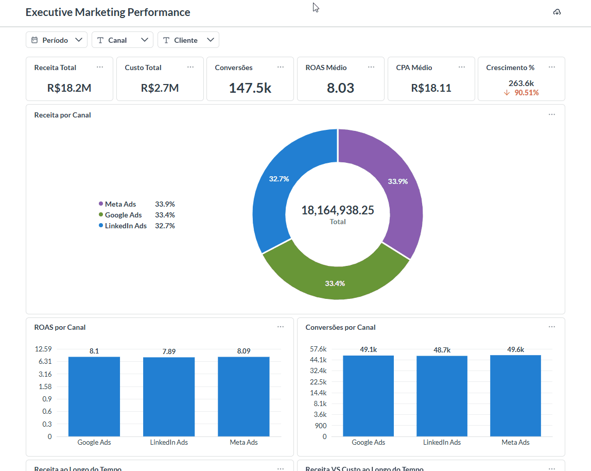
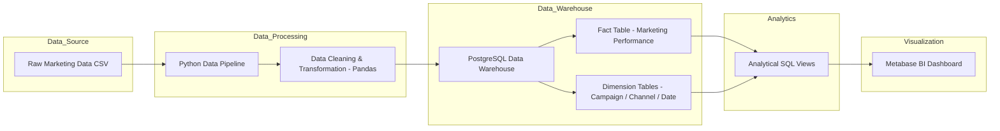

# 📊 Marketing Data Pipeline & Analytics Dashboard


End-to-end **Marketing Data Analytics project** that simulates a modern marketing analytics workflow.

The project demonstrates how raw marketing data can be **processed, modeled, and analyzed** to generate business insights through a **BI dashboard built with Metabase**.

It was designed as a **portfolio project for Data Analyst roles**, showcasing skills in:

- Data analysis
- SQL analytics
- Data modeling
- Business metrics
- Dashboard development
- Data pipeline fundamentals

---

# 🚀 Project Overview

This project simulates a **marketing analytics workflow** used by companies to evaluate campaign performance.

The pipeline processes raw marketing campaign data and transforms it into analytical tables used to answer questions such as:

- How much revenue campaigns generate
- Which marketing channels convert best
- How campaign performance evolves over time
- Which channels produce the highest ROI

The processed data is then explored through an **interactive BI dashboard**.

---

# 🎥 Dashboard Demo

Below is a demonstration of the interactive marketing analytics dashboard built with **Metabase**.

The dashboard allows exploration of key marketing metrics such as revenue, conversions, and campaign performance across different channels.



---

# 📈 Business Questions Answered

This project focuses on answering **real marketing analytics questions**, similar to what data analysts solve in marketing or growth teams.

Examples include:

- Which marketing channel generates the highest revenue?
- Which campaigns have the best conversion rate?
- What is the ROI per marketing channel?
- How does campaign performance evolve over time?
- Which channels generate the most conversions?

These insights help simulate how marketing teams **analyze campaign performance and optimize budgets**.

---

# 📊 Key Metrics Analyzed

The analysis focuses on common **marketing performance KPIs**:

- Revenue
- Conversions
- Conversion Rate
- Revenue by Marketing Channel
- Campaign Performance
- Return on Investment (ROI)

These metrics are calculated during the transformation step and explored in the dashboard.

---

# 🧱 Architecture

Below is the simplified architecture of the analytics pipeline.



This structure reflects a simplified **modern analytics stack** used in data-driven organizations.

---

# ⚙️ Technologies Used

| Layer | Technology |
|------|-------------|
| Data Processing | Python |
| Data Transformation | Pandas |
| Database | PostgreSQL |
| Data Modeling | Star Schema |
| Visualization | Metabase |
| Containerization | Docker |
| Environment | Docker Compose |

---

# 📂 Project Structure

```
marketing-data-pipeline/
│
├── data/
│   └── raw_marketing_data.csv
│
├── pipeline/
│   └── marketing_pipeline.py
│
├── sql/
│   ├── create_tables.sql
│   └── analytical_views.sql
│
├── dashboard/
│   └── Dockerfile
│
├── docs/
│   └── gifs/
│
├── docker-compose.yml
│
└── README.md
```

---

# 🔄 Data Pipeline

The pipeline performs the following analytical workflow.

---

## 1️⃣ Data Ingestion

Raw marketing data is loaded from a CSV dataset.

Example fields include:

- campaign_id
- channel
- impressions
- clicks
- conversions
- revenue

---

## 2️⃣ Data Transformation

Using **Pandas**, the pipeline performs several data preparation steps:

- Data cleaning
- Column standardization
- Handling missing values
- Aggregations
- Metric calculations

This step prepares the dataset for **analytical queries and reporting**.

---

## 3️⃣ Data Warehouse Modeling

The cleaned dataset is loaded into **PostgreSQL** using a **Star Schema**.

### Dimension Tables

- `dim_campaign`
- `dim_channel`
- `dim_date`

### Fact Table

- `fact_marketing_performance`

This structure improves query performance and supports BI dashboards.

---

## 4️⃣ Analytical Views

SQL views are created to simplify analytical queries.

Examples include:

- total_revenue
- conversions_by_channel
- campaign_performance
- conversion_rate_by_channel

These views power the **BI dashboard and business analysis**.

---

# 📊 Dashboard (Metabase)

The dashboard allows interactive exploration of marketing performance.

Examples of visualizations include:

- Revenue trends over time
- Conversion tracking
- Campaign comparison
- Channel performance analysis

Metabase connects directly to the **PostgreSQL Data Warehouse**, enabling analysts to explore the data through filters and queries.

---

# 🐳 Running the Project with Docker

The entire environment can run locally using **Docker Compose**.

Services include:

- PostgreSQL database
- Metabase BI tool
- Python data pipeline

To start the environment:

```
docker-compose up --build
```

Once the environment is running, the pipeline processes the data and loads it into the warehouse.

---

# ⚠️ Dashboard Deployment Note

The BI environment was designed to support containerized deployment using Docker.

Due to memory limitations on the free tier of Render, the dashboard was not deployed to the cloud.

However, the full analytics stack runs locally using Docker Compose, and the dashboard functionality is demonstrated in the GIF above.

---

# 🎯 Purpose of the Project

This project was created to demonstrate practical skills relevant to **data analyst roles**, including:

- Data analysis
- SQL-based analytics
- Business metric analysis
- Data modeling
- Dashboard development
- Data pipeline fundamentals

It represents a simplified but realistic **marketing analytics workflow**.

---

# 📌 Future Improvements

Possible improvements for future versions include:

- Automated data ingestion
- dbt transformations
- Airflow orchestration
- Cloud deployment
- Data quality validation
- CI/CD pipeline

---

# 👨‍💻 Author

Portfolio project developed to demonstrate **Data Analysis and Analytics skills**.

Feel free to explore the repository and the pipeline architecture.

---

# ⭐ Project Highlights

✔ End-to-end marketing analytics workflow  
✔ PostgreSQL data warehouse  
✔ Star schema modeling  
✔ SQL analytical views  
✔ BI dashboard with Metabase  
✔ Dockerized environment  
✔ Portfolio-ready analytics project